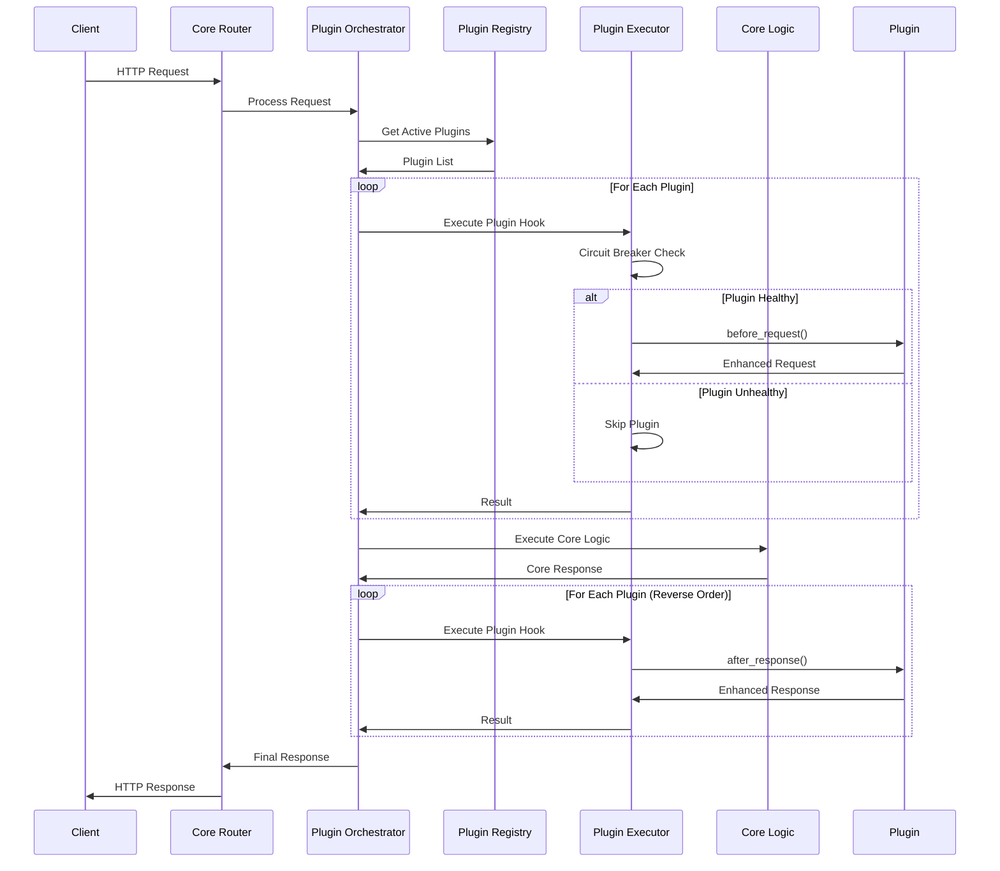

# 🏗️ Backworks Architecture Revision & Finalization

## 📋 Current State Analysis

### ✅ Strengths of Current Architecture

1. **Plugin Interface Design**
   - Clean trait-based plugin interface
   - Async support with proper hooks
   - Configuration-driven plugin management
   - Hot-reload capabilities

2. **Core Separation**
   - Minimal core with clear boundaries
   - Plugin manager as central orchestrator
   - Configuration system supports plugins

3. **Extensibility**
   - Standardized plugin development patterns
   - Clear lifecycle management
   - Request/response hook system

### ⚠️ Areas Needing Refinement

1. **Plugin Discovery & Registry**
   - Currently hardcoded plugin registration
   - No dynamic plugin discovery
   - Missing plugin dependency management

2. **Error Handling & Resilience**
   - Plugin failures can affect entire request
   - No circuit breaker pattern for plugins
   - Limited error isolation

3. **Performance & Resource Management**
   - No resource limits for plugins
   - Missing performance monitoring
   - No plugin priority/ordering system

4. **Configuration Complexity**
   - Mixed configuration approach (core + plugin configs)
   - Validation scattered across components
   - No schema validation for plugin configs

5. **Testing & Development Experience**
   - No plugin development toolkit
   - Missing plugin testing framework
   - Limited debugging capabilities

## 🎯 Revised Architecture Proposal

### 1. Enhanced Plugin Discovery System

```rust
/// Plugin registry for automatic discovery and management
pub struct PluginRegistry {
    discovered_plugins: HashMap<String, PluginMetadata>,
    plugin_loader: Box<dyn PluginLoader>,
    dependency_resolver: DependencyResolver,
}

pub struct PluginMetadata {
    pub name: String,
    pub version: String,
    pub description: String,
    pub dependencies: Vec<PluginDependency>,
    pub capabilities: Vec<PluginCapability>,
    pub config_schema: serde_json::Value,
}

#[async_trait::async_trait]
pub trait PluginLoader: Send + Sync {
    async fn discover_plugins(&self) -> BackworksResult<Vec<PluginMetadata>>;
    async fn load_plugin(&self, metadata: &PluginMetadata) -> BackworksResult<Box<dyn BackworksPlugin>>;
    async fn unload_plugin(&self, name: &str) -> BackworksResult<()>;
}
```

### 2. Improved Error Handling & Resilience

```rust
/// Enhanced plugin interface with error isolation
#[async_trait::async_trait]
pub trait BackworksPlugin: Send + Sync {
    // Existing methods...
    
    /// Plugin health check
    async fn health_check(&self) -> PluginHealth;
    
    /// Plugin metrics for monitoring
    async fn get_metrics(&self) -> PluginMetrics;
    
    /// Maximum execution time for hooks (for circuit breaker)
    fn max_execution_time(&self) -> Duration { Duration::from_millis(100) }
    
    /// Whether plugin failure should fail the entire request
    fn is_critical(&self) -> bool { false }
}

pub struct PluginExecutor {
    circuit_breakers: HashMap<String, CircuitBreaker>,
    metrics_collector: MetricsCollector,
    timeout_config: TimeoutConfig,
}

impl PluginExecutor {
    pub async fn execute_with_resilience<F, T>(&self, plugin_name: &str, operation: F) -> PluginResult<T>
    where
        F: Future<Output = BackworksResult<T>> + Send,
    {
        // Circuit breaker, timeout, and error isolation logic
    }
}
```

### 3. Resource Management & Performance

```rust
/// Resource limits and monitoring for plugins
pub struct PluginResourceManager {
    resource_limits: HashMap<String, ResourceLimits>,
    usage_monitor: ResourceMonitor,
    performance_tracker: PerformanceTracker,
}

pub struct ResourceLimits {
    pub max_memory: Option<usize>,
    pub max_cpu_time: Option<Duration>,
    pub max_concurrent_operations: Option<usize>,
    pub max_file_handles: Option<usize>,
}

pub struct PluginPerformanceMetrics {
    pub average_execution_time: Duration,
    pub total_invocations: u64,
    pub error_rate: f64,
    pub memory_usage: usize,
    pub cpu_usage: f64,
}
```

### 4. Unified Configuration System

```rust
/// Unified configuration with validation
pub struct BackworksConfiguration {
    pub core: CoreConfig,
    pub plugins: PluginConfigurations,
    pub schema_validator: ConfigValidator,
}

pub struct PluginConfigurations {
    configs: HashMap<String, ValidatedPluginConfig>,
    schemas: HashMap<String, serde_json::Value>,
}

impl PluginConfigurations {
    pub async fn validate_all(&self) -> ConfigValidationResult {
        // Validate all plugin configs against their schemas
    }
    
    pub async fn hot_reload(&mut self, changes: ConfigChanges) -> BackworksResult<()> {
        // Hot-reload only changed configurations
    }
}
```

### 5. Plugin Development Kit

```rust
/// Plugin development toolkit
pub struct PluginDevKit {
    pub testing_framework: PluginTestFramework,
    pub mock_core: MockBackworksCore,
    pub performance_profiler: PluginProfiler,
    pub debugging_tools: PluginDebugger,
}

/// Testing framework for plugins
pub struct PluginTestFramework {
    pub test_runner: PluginTestRunner,
    pub assertion_helpers: AssertionHelpers,
    pub mock_generators: MockGenerators,
}

/// Mock core for testing plugins in isolation
pub struct MockBackworksCore {
    pub mock_requests: MockRequestFactory,
    pub mock_responses: MockResponseFactory,
    pub mock_config: MockConfigFactory,
}
```

## 🔧 Refined Core Architecture

### 1. Minimal Core Components

```rust
/// Ultra-minimal core focusing only on essential functionality
pub struct BackworksCore {
    pub config_manager: ConfigManager,
    pub request_router: RequestRouter,
    pub plugin_orchestrator: PluginOrchestrator,
    pub lifecycle_manager: LifecycleManager,
}

/// Plugin orchestrator handles all plugin interactions
pub struct PluginOrchestrator {
    pub registry: PluginRegistry,
    pub executor: PluginExecutor,
    pub resource_manager: PluginResourceManager,
    pub performance_monitor: PluginPerformanceMonitor,
}
```

### 2. Plugin Categories & Interfaces

```rust
/// Specialized plugin interfaces for different types
pub trait RequestProcessorPlugin: BackworksPlugin {
    async fn process_request(&self, request: &mut Request<Body>) -> PluginResult<RequestAction>;
}

pub trait ResponseEnhancerPlugin: BackworksPlugin {
    async fn enhance_response(&self, response: &mut Response<Body>) -> PluginResult<ResponseAction>;
}

pub trait MonitoringPlugin: BackworksPlugin {
    async fn collect_metrics(&self, context: &RequestContext) -> PluginResult<Metrics>;
    async fn generate_alerts(&self, metrics: &Metrics) -> PluginResult<Vec<Alert>>;
}

pub trait SecurityPlugin: BackworksPlugin {
    async fn authenticate(&self, request: &Request<Body>) -> PluginResult<AuthResult>;
    async fn authorize(&self, request: &Request<Body>, user: &User) -> PluginResult<AuthzResult>;
    async fn audit_log(&self, context: &SecurityContext) -> PluginResult<()>;
}

pub trait AnalyticsPlugin: BackworksPlugin {
    async fn track_event(&self, event: &AnalyticsEvent) -> PluginResult<()>;
    async fn generate_report(&self, query: &ReportQuery) -> PluginResult<Report>;
}
```

### 3. Enhanced Request Flow



## 🎯 Implementation Priority

### Phase 1: Core Stability (Week 1)
1. **Enhanced Error Handling**
   - Plugin error isolation
   - Circuit breaker implementation
   - Graceful degradation

2. **Resource Management**
   - Plugin resource limits
   - Performance monitoring
   - Memory usage tracking

3. **Configuration Validation**
   - Schema-based plugin config validation
   - Hot-reload safety checks
   - Configuration migration support

### Phase 2: Developer Experience (Week 2)
1. **Plugin Development Kit**
   - Testing framework
   - Mock core implementation
   - Development tools

2. **Enhanced Discovery**
   - Plugin registry implementation
   - Dependency resolution
   - Dynamic loading system

3. **Monitoring & Observability**
   - Plugin performance metrics
   - Health monitoring
   - Debug logging

### Phase 3: Advanced Features (Week 3)
1. **Advanced Plugin Types**
   - Specialized plugin interfaces
   - Plugin composition patterns
   - Plugin dependency injection

2. **Production Features**
   - Plugin hot-swapping
   - Version management
   - Rollback capabilities

3. **Ecosystem Tools**
   - Plugin marketplace preparation
   - Community templates
   - Documentation generators

## 🎯 Final Architecture Decisions

### 1. **Plugin-First Everything**
   - Even core features like routing can be enhanced via plugins
   - Minimal core with maximum extensibility
   - Zero-dependency core principle maintained

### 2. **Safety & Resilience**
   - Plugin failures never crash the core
   - Circuit breakers for unreliable plugins
   - Resource isolation and limits

### 3. **Developer Experience**
   - Rich plugin development toolkit
   - Comprehensive testing support
   - Hot-reload without service interruption

### 4. **Performance**
   - Sub-millisecond plugin execution
   - Lazy loading of plugin dependencies
   - Performance monitoring built-in

### 5. **Production Ready**
   - Health monitoring and alerting
   - Graceful plugin lifecycle management
   - Configuration validation and safety

This revised architecture maintains our plugin-first philosophy while adding the robustness, safety, and developer experience needed for production use.
