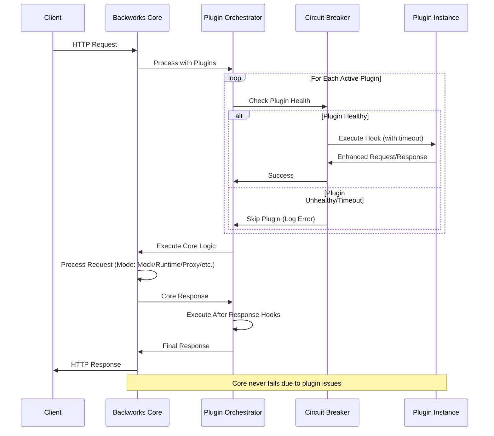

# 🏗️ Backworks Final Architecture Specification

## 🎯 Architecture Overview

Backworks is a **plugin-first API development platform** with a minimal, resilient core and a rich ecosystem of optional plugins. The architecture prioritizes safety, performance, and developer experience while maintaining complete modularity.

## 🔧 Core Principles (Finalized)

### 1. **Minimal Core, Maximum Extensions**
- Core engine < 10MB with zero AI/ML dependencies
- All advanced features delivered via optional plugins
- Plugin failures never crash the core system
- Resource isolation between core and plugins

### 2. **Safety & Resilience First**
- Circuit breakers prevent cascading plugin failures
- Resource limits protect against plugin resource abuse
- Error isolation ensures core stability
- Graceful degradation when plugins fail

### 3. **Developer Experience Priority**
- Rich plugin development toolkit
- Hot-reload without service interruption
- Comprehensive testing framework
- Clear plugin interfaces and documentation

### 4. **Production Ready**
- Performance monitoring and alerting
- Configuration validation and safety
- Health monitoring and auto-recovery
- Resource usage tracking and limits

## 🏛️ Core Architecture Components

### 1. Backworks Core (Minimal)
```rust
pub struct BackworksCore {
    pub config_manager: ConfigManager,           // Configuration parsing and validation
    pub request_router: RequestRouter,           // HTTP request routing
    pub plugin_orchestrator: PluginOrchestrator, // Plugin lifecycle management
    pub lifecycle_manager: LifecycleManager,     // System lifecycle
}
```

### 2. Plugin Orchestrator (Central Hub)
```rust
pub struct PluginOrchestrator {
    pub registry: PluginRegistry,                 // Plugin discovery and metadata
    pub executor: PluginExecutor,                 // Safe plugin execution
    pub resource_manager: PluginResourceManager,  // Resource limits and monitoring
    pub performance_monitor: PerformanceMonitor,  // Plugin performance tracking
}
```

### 3. Plugin Interface (Standardized)
```rust
#[async_trait::async_trait]
pub trait BackworksPlugin: Send + Sync {
    // Metadata
    fn name(&self) -> &str;
    fn version(&self) -> &str;
    fn description(&self) -> &str;
    
    // Lifecycle
    async fn initialize(&self, config: &Value) -> BackworksResult<()>;
    async fn shutdown(&self) -> BackworksResult<()>;
    async fn health_check(&self) -> PluginHealth;
    
    // Request/Response hooks
    async fn before_request(&self, request: &mut Request<Body>) -> BackworksResult<()>;
    async fn after_response(&self, response: &mut Response<Body>) -> BackworksResult<()>;
    
    // Configuration
    async fn on_config_reload(&self, config: &Value) -> BackworksResult<()>;
    
    // Resource management
    fn max_execution_time(&self) -> Duration { Duration::from_millis(100) }
    fn is_critical(&self) -> bool { false }
}
```

## 🔌 Plugin Categories

### 1. Enhancement Plugins
- **AI Plugin**: ML/AI features (smart responses, pattern detection)
- **Analytics Plugin**: Request tracking, metrics, insights
- **Security Plugin**: Authentication, authorization, audit logging
- **Cache Plugin**: Intelligent caching strategies

### 2. Infrastructure Plugins
- **Monitoring Plugin**: Health monitoring, alerting, dashboards
- **Logging Plugin**: Advanced logging, log aggregation
- **Tracing Plugin**: Distributed tracing, performance analysis
- **Database Plugin**: Database connection pooling, query optimization

### 3. Integration Plugins
- **Webhook Plugin**: Webhook management and delivery
- **Notification Plugin**: Email, SMS, Slack notifications
- **Storage Plugin**: File storage, object storage integration
- **Queue Plugin**: Message queue integration

## 🔄 Request Flow (Resilient)



## 📊 Configuration Architecture

### 1. Unified Configuration Structure
```yaml
# backworks.yaml - Single configuration file
name: "my-api"
mode: "hybrid"

# Core configuration (always present)
server:
  port: 8080
  host: "0.0.0.0"

endpoints:
  "/users":
    methods: ["GET", "POST"]
    mode: "database"
    # ... endpoint config

# Plugin configuration (optional)
plugins:
  ai:
    enabled: true
    config:
      features: ["smart_responses", "pattern_detection"]
      model: "gpt-4"
      context_window: 4000
      
  analytics:
    enabled: true
    config:
      storage_backend: "postgresql"
      retention_period: "30d"
      
  security:
    enabled: false  # Plugin disabled
    
  monitoring:
    enabled: true
    config:
      dashboard_port: 9090
      metrics_interval: "10s"
```

### 2. Configuration Validation
```rust
pub struct ConfigValidator {
    core_schema: serde_json::Value,
    plugin_schemas: HashMap<String, serde_json::Value>,
}

impl ConfigValidator {
    pub async fn validate_full_config(&self, config: &BackworksConfig) -> ValidationResult {
        // Validate core config + all plugin configs against schemas
    }
    
    pub async fn validate_plugin_config(&self, plugin_name: &str, config: &Value) -> ValidationResult {
        // Validate individual plugin configuration
    }
}
```

## 🛡️ Safety & Resilience Features

### 1. Circuit Breaker Pattern
```rust
pub struct PluginCircuitBreaker {
    state: CircuitBreakerState,
    failure_threshold: usize,
    recovery_timeout: Duration,
    failure_count: AtomicUsize,
    last_failure: AtomicU64,
}

impl PluginCircuitBreaker {
    pub async fn execute<F, T>(&self, operation: F) -> CircuitBreakerResult<T>
    where F: Future<Output = BackworksResult<T>> + Send
    {
        match self.state {
            CircuitBreakerState::Closed => self.try_execute(operation).await,
            CircuitBreakerState::Open => Err(CircuitBreakerError::Open),
            CircuitBreakerState::HalfOpen => self.test_execute(operation).await,
        }
    }
}
```

### 2. Resource Management
```rust
pub struct PluginResourceLimits {
    pub max_memory: Option<usize>,
    pub max_cpu_time: Option<Duration>,
    pub max_concurrent_operations: Option<usize>,
    pub max_file_handles: Option<usize>,
}

pub struct PluginResourceMonitor {
    limits: PluginResourceLimits,
    current_usage: Arc<RwLock<ResourceUsage>>,
    violation_handler: Box<dyn ResourceViolationHandler>,
}
```

### 3. Performance Monitoring
```rust
pub struct PluginPerformanceTracker {
    metrics: HashMap<String, PluginMetrics>,
    thresholds: PerformanceThresholds,
    alert_manager: AlertManager,
}

pub struct PluginMetrics {
    pub average_execution_time: Duration,
    pub p95_execution_time: Duration,
    pub total_invocations: u64,
    pub error_rate: f64,
    pub memory_usage: usize,
}
```

## 🎯 Implementation Strategy

### Phase 1: Core Resilience (Week 1)
1. **Error Isolation**: Plugin failures don't affect core
2. **Circuit Breakers**: Auto-disable failing plugins  
3. **Resource Limits**: Prevent resource abuse
4. **Performance Monitoring**: Track plugin performance

### Phase 2: Developer Experience (Week 2)
1. **Plugin Development Kit**: Tools for plugin development
2. **Testing Framework**: Comprehensive plugin testing
3. **Hot-reload**: Safe configuration changes
4. **Documentation**: Plugin development guides

### Phase 3: Real-World Validation (Week 3)
1. **Complete Plugin Implementations**: AI, Analytics, Security, Monitoring
2. **Example Applications**: E-commerce, CMS, SaaS examples
3. **Performance Benchmarks**: Validate performance claims
4. **Production Documentation**: Deployment and operations guides

## 🎖️ Success Criteria

### Technical Goals
- [ ] Plugin failures never crash core (100% isolation)
- [ ] Plugin overhead < 5ms per request per plugin
- [ ] Hot-reload works without service interruption
- [ ] 90%+ test coverage for plugin system

### User Experience Goals
- [ ] Plugin development takes < 1 hour for basic plugin
- [ ] Configuration validation catches errors before deployment
- [ ] Clear error messages and debugging information
- [ ] Real-world examples work out of the box

### Production Readiness Goals
- [ ] Resource usage monitoring and alerting
- [ ] Performance metrics and optimization recommendations
- [ ] Health monitoring with auto-recovery
- [ ] Production deployment documentation

This finalized architecture provides a solid foundation for building a robust, extensible, and production-ready API development platform with a thriving plugin ecosystem.
