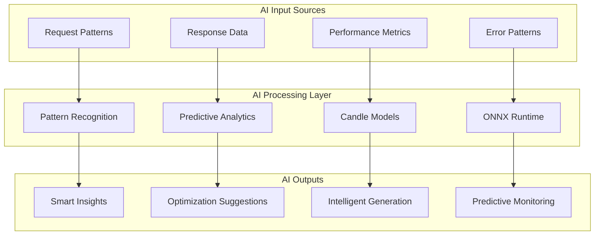

# 🤖 AI Features

Backworks integrates advanced AI capabilities using **Candle** (Rust ML framework) and **ONNX runtime** to enhance every aspect of API development, from intelligent pattern recognition to predictive optimization.

## 🧠 AI Enhancement Overview



## 🎯 Core AI Features

### 1. **Pattern Recognition**
Automatically identify and classify API usage patterns:

```yaml
ai:
  pattern_recognition:
    enabled: true
    models:
      endpoint_classifier:
        type: "onnx"
        path: "./models/endpoint_patterns.onnx"
        confidence_threshold: 0.8
        
    features:
      - "crud_pattern_detection"      # Identify CRUD operations
      - "user_journey_analysis"       # Track user behavior flows  
      - "api_usage_classification"    # Categorize API usage types
      - "bottleneck_identification"   # Detect performance bottlenecks
      - "error_pattern_analysis"      # Classify error patterns
```

**Example Output:**
```json
{
  "detected_patterns": [
    {
      "pattern": "user_authentication_flow",
      "confidence": 0.92,
      "endpoints": ["/login", "/profile", "/logout"],
      "frequency": 450,
      "optimization_suggestion": "Consider JWT token caching"
    },
    {
      "pattern": "data_export_batch",
      "confidence": 0.87,
      "trigger": "GET /reports with large response times",
      "suggestion": "Implement async processing"
    }
  ]
}
```

### 2. **Schema Prediction**
Intelligently predict missing fields and improve data structures:

```yaml
ai:
  schema_prediction:
    enabled: true
    models:
      schema_predictor:
        type: "candle"
        path: "./models/schema_prediction.safetensors"
        
    features:
      - "missing_field_prediction"    # Predict likely missing fields
      - "data_type_inference"         # Infer optimal data types
      - "relationship_detection"      # Detect entity relationships
      - "validation_suggestion"       # Suggest validation rules
```

**Example Enhancement:**
```yaml
# Original endpoint
endpoints:
  users:
    path: "/users"
    mock:
      data:
        - id: 1
          name: "John Doe"

# AI-enhanced version
endpoints:
  users:
    path: "/users"
    ai_enhanced: true
    mock:
      data:
        - id: 1
          name: "John Doe"
          email: "john@example.com"      # AI predicted
          created_at: "2025-01-15T10:00:00Z"  # AI predicted
          status: "active"               # AI predicted
          preferences: {}                # AI predicted
    
    ai_suggestions:
      missing_fields:
        - name: "email"
          confidence: 0.95
          reasoning: "95% of user APIs include email field"
        - name: "created_at"
          confidence: 0.89
          reasoning: "Timestamp tracking is common pattern"
```

### 3. **Intelligent Mock Data Generation**
Generate realistic, contextually appropriate mock data:

```yaml
ai:
  mock_generation:
    enabled: true
    models:
      data_generator:
        type: "candle"
        path: "./models/realistic_data_gen.safetensors"
        
    features:
      - "realistic_name_generation"    # Generate realistic names
      - "contextual_email_creation"    # Create matching emails
      - "geographic_data_consistency"  # Consistent location data
      - "temporal_pattern_matching"    # Realistic timestamps
      - "relationship_preservation"    # Maintain data relationships

endpoints:
  users:
    path: "/users"
    mock:
      ai_generated: true
      count: 100                      # Generate 100 realistic users
      patterns:
        - "north_american_names"      # Geographic preference
        - "tech_company_emails"       # Email domain patterns
        - "recent_registrations"      # Temporal patterns
```

**Generated Data Example:**
```json
[
  {
    "id": 1,
    "name": "Sarah Chen",
    "email": "sarah.chen@techcorp.com",
    "created_at": "2025-01-14T15:32:18Z",
    "location": "San Francisco, CA",
    "preferences": {
      "notifications": true,
      "timezone": "America/Los_Angeles"
    }
  }
]
```

### 4. **Performance Prediction**
Predict performance bottlenecks and optimization opportunities:

```yaml
ai:
  performance_prediction:
    enabled: true
    models:
      performance_predictor:
        type: "onnx"
        path: "./models/performance_prediction.onnx"
        
    features:
      - "response_time_forecasting"    # Predict response times
      - "load_capacity_estimation"     # Estimate capacity limits
      - "bottleneck_prediction"        # Predict future bottlenecks
      - "scaling_recommendations"      # Suggest scaling strategies
```

**Prediction Dashboard:**
```json
{
  "performance_predictions": {
    "next_24h": {
      "peak_load_time": "2025-01-16T14:00:00Z",
      "estimated_requests": 1250,
      "bottleneck_probability": 0.73,
      "recommended_actions": [
        "Scale horizontally by 2x",
        "Enable caching for /users endpoint",
        "Consider read replicas for database"
      ]
    }
  }
}
```

### 5. **Anomaly Detection**
Detect unusual patterns and potential security threats:

```yaml
ai:
  anomaly_detection:
    enabled: true
    models:
      anomaly_detector:
        type: "onnx"
        path: "./models/anomaly_detection.onnx"
        
    detection_types:
      - "unusual_traffic_patterns"     # Traffic anomalies
      - "potential_attacks"            # Security threats
      - "data_integrity_issues"        # Data quality problems
      - "performance_degradation"      # Performance issues
      
    alert_thresholds:
      security_threat: 0.9
      performance_issue: 0.8
      data_anomaly: 0.7
```

**Anomaly Alerts:**
```json
{
  "anomalies_detected": [
    {
      "type": "unusual_traffic_pattern",
      "confidence": 0.94,
      "description": "400% increase in POST /users requests",
      "timestamp": "2025-01-15T16:45:00Z",
      "severity": "high",
      "recommended_action": "Enable rate limiting"
    },
    {
      "type": "potential_sql_injection",
      "confidence": 0.87,
      "endpoint": "/users/search?q='; DROP TABLE users; --",
      "severity": "critical",
      "action_taken": "Request blocked"
    }
  ]
}
```

## 🔄 AI-Driven Reverse API Generation

### Intelligent Request Analysis
```yaml
mode: "capture"
ai:
  capture_analysis:
    enabled: true
    models:
      request_analyzer:
        type: "onnx"
        path: "./models/request_analysis.onnx"
        
    analysis_features:
      - "endpoint_discovery"          # Discover API endpoints
      - "parameter_extraction"        # Extract parameters
      - "authentication_detection"    # Detect auth patterns
      - "rate_limit_analysis"         # Analyze rate limits
      - "error_pattern_mapping"       # Map error responses
```

**Auto-Generated Configuration:**
```yaml
# Generated from captured requests
name: "discovered_api"
description: "Auto-generated from 2,450 captured requests over 7 days"

endpoints:
  users:
    path: "/users"
    methods: ["GET", "POST"]
    # Discovered from 450 requests
    confidence: 0.96
    
    parameters:
      - name: "limit"
        type: "integer"
        default: 10
        # Detected in 78% of requests
        usage_frequency: 0.78
        
    authentication:
      type: "bearer"
      # Detected in 92% of requests
      confidence: 0.92
      
    ai_insights:
      typical_usage: "Admin dashboard user management"
      peak_usage_times: ["09:00-11:00", "14:00-16:00"]
      common_patterns: ["pagination", "filtering", "sorting"]
```

## 🚀 AI-Enhanced Development Workflow

### 1. **Smart Prototyping**
```yaml
ai:
  prototyping_assistant:
    enabled: true
    suggest_endpoints: true        # Suggest missing endpoints
    generate_test_data: true       # Create realistic test data
    recommend_patterns: true       # Suggest API patterns
    
endpoints:
  users:
    path: "/users"
    ai_suggestions:
      related_endpoints:
        - "/users/{id}/profile"
          confidence: 0.89
          reasoning: "Common user management pattern"
        - "/users/{id}/preferences"
          confidence: 0.76
          reasoning: "Frequent user customization needs"
```

### 2. **Intelligent Evolution**
```yaml
mode: "evolving"
ai:
  evolution_guidance:
    enabled: true
    recommend_transitions: true    # Suggest mode transitions
    optimize_configurations: true # Optimize config settings
    predict_requirements: true    # Predict future needs
    
evolution:
  ai_driven: true
  triggers:
    to_runtime:
      ai_confidence: 0.85
      reasoning: "Complex business logic patterns detected"
    to_database:
      ai_confidence: 0.92
      reasoning: "High data consistency requirements identified"
```

### 3. **Continuous Optimization**
```yaml
ai:
  continuous_optimization:
    enabled: true
    optimization_frequency: "daily"
    
    optimizations:
      - "cache_strategy_tuning"      # Optimize caching
      - "query_optimization"         # Improve database queries
      - "response_compression"       # Optimize response sizes
      - "endpoint_consolidation"     # Merge similar endpoints
```

## 🔧 Custom AI Models

### Training Custom Models
```yaml
ai:
  custom_models:
    business_logic_predictor:
      type: "candle"
      training_data: "./training/business_patterns.json"
      model_architecture: "transformer"
      training_config:
        epochs: 100
        learning_rate: 0.001
        batch_size: 32
        
    security_classifier:
      type: "onnx" 
      pre_trained_model: "./models/security_base.onnx"
      fine_tune_data: "./training/security_incidents.json"
```

### Model Performance Monitoring
```yaml
ai:
  model_monitoring:
    enabled: true
    metrics:
      - "prediction_accuracy"
      - "inference_latency"
      - "model_drift_detection"
      - "confidence_calibration"
      
    retraining:
      auto_retrain: true
      accuracy_threshold: 0.85
      data_drift_threshold: 0.1
```

## 📊 AI Dashboard & Insights

### Real-Time AI Insights
```yaml
dashboard:
  ai_insights:
    enabled: true
    sections:
      - "pattern_analysis"           # Current pattern insights
      - "performance_predictions"    # Future performance forecasts  
      - "optimization_suggestions"   # Improvement recommendations
      - "anomaly_alerts"            # Security and error alerts
      - "model_performance"         # AI model metrics
```

### AI-Generated Documentation
```yaml
ai:
  documentation_generation:
    enabled: true
    formats: ["markdown", "openapi", "html"]
    
    features:
      - "endpoint_descriptions"      # Auto-describe endpoints
      - "usage_examples"            # Generate realistic examples
      - "integration_guides"        # Create integration docs
      - "troubleshooting_guides"    # Generate help content
```

## 🔒 AI Security & Privacy

### Privacy Protection
```yaml
ai:
  privacy:
    anonymize_data: true           # Anonymize sensitive data
    local_processing: true         # Process data locally
    no_external_calls: true        # No external AI services
    data_retention: "30d"          # Limit data retention
    
  security:
    model_encryption: true         # Encrypt AI models
    secure_inference: true         # Secure inference execution
    audit_logging: true            # Log AI decisions
```

### Explainable AI
```yaml
ai:
  explainability:
    enabled: true
    provide_reasoning: true        # Explain AI decisions
    confidence_scores: true        # Show confidence levels
    feature_importance: true       # Show decision factors
    
    explanations:
      format: "natural_language"
      detail_level: "high"
      include_alternatives: true
```

## 🚀 Getting Started with AI Features

### Basic AI Setup
```yaml
# Minimal AI configuration
ai:
  enabled: true
  features: ["pattern_recognition", "mock_improvement"]
```

### Advanced AI Setup
```yaml
# Full AI capabilities
ai:
  enabled: true
  features:
    - "pattern_recognition"
    - "schema_prediction"
    - "performance_prediction" 
    - "anomaly_detection"
    - "mock_generation"
    - "documentation_generation"
    
  models:
    # Use pre-trained models
    pattern_classifier: { type: "onnx", path: "./models/patterns.onnx" }
    data_generator: { type: "candle", path: "./models/generator.safetensors" }
    
  settings:
    confidence_threshold: 0.8
    update_frequency: "real_time"
    learning_enabled: true
```

Backworks' AI features transform API development from reactive to predictive, making your APIs more intelligent, secure, and optimized over time.
