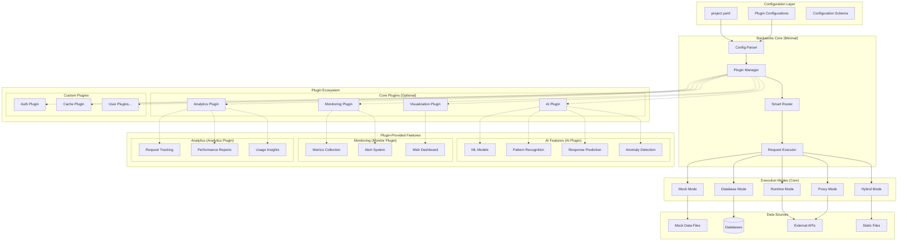
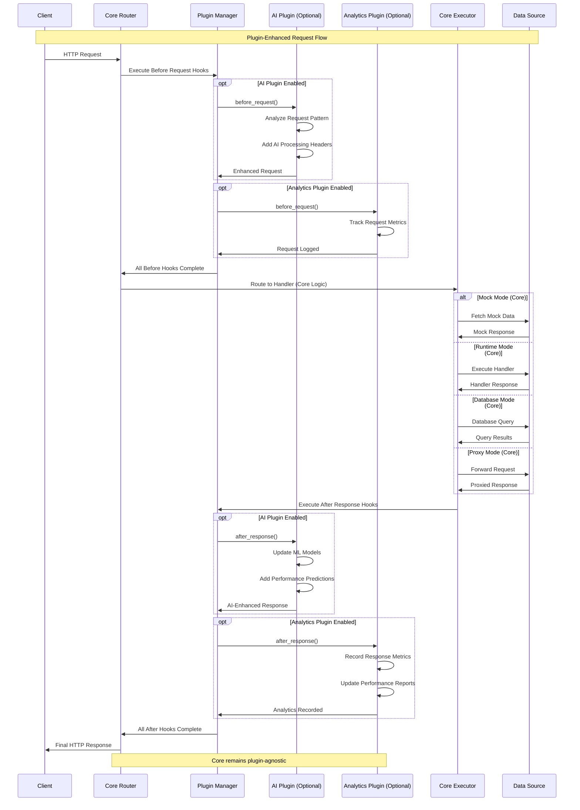
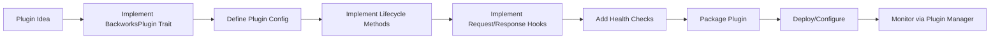

# 🏗️ Backworks Architecture

Backworks is built on a **plugin-first, modular core** philosophy. The architecture prioritizes a minimal, focused core with all advanced features implemented as detachable plugins. This enables seamless evolution from simple mock APIs to production-ready services while maintaining clean separation of concerns and zero vendor lock-in.

## 🎯 Core Design Philosophy

### 1. **Plugin-First Architecture**
- **Minimal Core**: Only essential routing, configuration, and plugin management
- **Everything is a Plugin**: AI, analytics, monitoring, custom handlers - all pluggable
- **Zero Dependencies**: Core has no external AI or ML dependencies
- **Opt-in Complexity**: Add features only when needed

### 2. **Configuration-Driven Everything**
- Single YAML file controls all behavior and plugin configuration
- No code changes required for mode transitions or plugin management
- Declarative approach to API development and plugin orchestration

### 3. **Mode Evolution Without Breaking Changes**
- Start with mock mode, evolve to runtime/proxy/database modes
- Plugin system allows feature addition without core modifications
- Backward compatibility maintained across all transitions

### 4. **Developer Experience First**
- Hot-reload plugin configuration without restarts
- Real-time architecture visualization (via visualization plugin)
- Clear plugin interfaces and development patterns

## 🏛️ System Architecture

The architecture is fundamentally centered around a **minimal core** with a **powerful plugin system**:



### Key Architectural Principles

1. **Core Independence**: The core engine has zero dependencies on AI, ML, or analytics libraries
2. **Plugin Isolation**: Each plugin is self-contained with its own dependencies
3. **Hot-Pluggable**: Plugins can be enabled/disabled via configuration changes
4. **Resource Efficient**: Only active plugins consume resources
5. **Development Friendly**: Clear plugin interfaces enable easy extension
## 🔧 Core Components (Plugin-Free)

### 1. **Configuration Parser**
- **Purpose**: YAML configuration validation and processing
- **Dependencies**: None (pure Rust)
- **Responsibilities**:
  - Schema validation
  - Environment variable resolution
  - Plugin configuration extraction
  - Mode configuration setup

### 2. **Plugin Manager**
- **Purpose**: Central orchestration of all plugins
- **Dependencies**: None (plugin trait definitions only)
- **Responsibilities**:
  - Plugin lifecycle management (init, start, stop, cleanup)
  - Plugin registration and discovery
  - Hook execution coordination
  - Plugin dependency resolution
  - Hot-reload support

### 3. **Smart Router**
- **Purpose**: HTTP request routing and middleware coordination
- **Dependencies**: None (standard HTTP libraries only)
- **Responsibilities**:
  - Dynamic route generation from configuration
  - Request/response middleware chain management
  - Plugin hook invocation points
  - Parameter validation and extraction

### 4. **Request Executor**
- **Purpose**: Core request processing logic
- **Dependencies**: Mode-specific handlers only
- **Responsibilities**:
  - Mode-aware request execution (mock, runtime, proxy, database)
  - Error handling and recovery
  - Resource management
  - Response formatting

## 🔌 Plugin System Architecture

### Plugin Interface
All plugins implement the standardized `BackworksPlugin` trait:

```rust
#[async_trait::async_trait]
pub trait BackworksPlugin: Send + Sync {
    /// Plugin metadata
    fn name(&self) -> &str;
    fn version(&self) -> &str;
    fn description(&self) -> &str;
    
    /// Lifecycle hooks
    async fn initialize(&self, config: &Value) -> BackworksResult<()>;
    async fn start(&self) -> BackworksResult<()>;
    async fn stop(&self) -> BackworksResult<()>;
    async fn cleanup(&self) -> BackworksResult<()>;
    
    /// Request/Response hooks
    async fn before_request(&self, request: &mut Request<Body>) -> BackworksResult<()>;
    async fn after_response(&self, response: &mut Response<Body>) -> BackworksResult<()>;
    
    /// Health and status
    async fn health_check(&self) -> BackworksResult<PluginHealth>;
    async fn get_metrics(&self) -> BackworksResult<PluginMetrics>;
}
```

### Plugin Manager Implementation
```rust
pub struct PluginManager {
    plugins: Arc<RwLock<HashMap<String, Arc<dyn BackworksPlugin>>>>,
    config: PluginConfig,
}

impl PluginManager {
    pub async fn load_plugins(&self, configs: &[PluginConfig]) -> BackworksResult<()> {
        // Load and initialize plugins based on configuration
    }
    
    pub async fn execute_before_hooks(&self, request: &mut Request<Body>) -> BackworksResult<()> {
        // Execute all plugin before_request hooks
    }
    
    pub async fn execute_after_hooks(&self, response: &mut Response<Body>) -> BackworksResult<()> {
        // Execute all plugin after_response hooks
    }
    
    pub async fn hot_reload(&self, plugin_name: &str, config: &Value) -> BackworksResult<()> {
        // Hot-reload specific plugin with new configuration
    }
}
```

## 🔄 Request Flow Architecture (Plugin-Enhanced)

The request flow demonstrates how the minimal core coordinates with plugins:



## 📊 Plugin-Based Data Flow

### Configuration Flow (Plugin-Aware)
```
YAML Config → Parser → Plugin Config Extraction → Plugin Manager → Plugin Initialization → Core Setup
```

### Plugin Lifecycle Flow
```
Config Change → Plugin Manager → Plugin Hot-Reload → Hook Re-registration → Live System Update
```

### Request Processing Flow (Minimal Core + Plugins)
```
HTTP Request → Core Router → Plugin Before Hooks → Core Handler → Plugin After Hooks → Core Response
```

### Monitoring Flow (Plugin-Driven)
```
Request/Response → Plugin Hooks → Plugin-Specific Metrics → Optional Dashboard → Optional Alerts
```
## 🤖 AI Plugin Architecture (Completely Optional)

The AI capabilities are now completely detached from the core and implemented as an optional plugin:

### AI Plugin Structure
```rust
pub struct AIPlugin {
    config: AIPluginConfig,
    models: Option<MLModels>,      // Only loaded if AI features enabled
    processor: AIProcessor,
}

pub struct AIPluginConfig {
    pub enabled: bool,                    // Master switch for all AI features
    pub features: HashSet<String>,        // Granular feature control
    pub model_path: Option<PathBuf>,      // Local model path
    pub api_config: Option<APIConfig>,    // External AI service config
    pub smart_responses: SmartResponsesConfig,
    pub pattern_detection: PatternDetectionConfig,
    pub performance_prediction: PredictionConfig,
}

#[async_trait::async_trait]
impl BackworksPlugin for AIPlugin {
    fn name(&self) -> &str { "ai" }
    
    async fn initialize(&self, config: &Value) -> BackworksResult<()> {
        if !self.config.enabled {
            return Ok(()); // No-op if disabled
        }
        
        // Only initialize AI dependencies when explicitly enabled
        self.load_models().await?;
        self.setup_processors().await?;
        Ok(())
    }
    
    async fn before_request(&self, request: &mut Request<Body>) -> BackworksResult<()> {
        if !self.config.enabled {
            return Ok(()); // No processing if disabled
        }
        
        // AI-enhanced request processing
        self.analyze_request_pattern(request).await?;
        self.add_ai_context_headers(request).await?;
        Ok(())
    }
    
    async fn after_response(&self, response: &mut Response<Body>) -> BackworksResult<()> {
        if !self.config.enabled {
            return Ok(()); // No processing if disabled
        }
        
        // AI-enhanced response processing
        self.update_ml_models(response).await?;
        self.add_performance_predictions(response).await?;
        self.detect_anomalies(response).await?;
        Ok(())
    }
}
```

### AI Plugin Features (When Enabled)

#### 1. **Smart Response Enhancement**
- Contextual response optimization
- Performance prediction headers
- Error pattern recognition

#### 2. **Pattern Detection and Learning**
- Request pattern analysis
- Usage trend identification
- Behavioral anomaly detection

#### 3. **Configuration Intelligence**
- AI-driven configuration suggestions
- Performance optimization recommendations
- Automatic schema generation from usage patterns

#### 4. **Zero Dependencies When Disabled**
- No ML libraries loaded if AI plugin is disabled
- Core remains completely AI-free
- Minimal memory footprint in non-AI mode

### AI Plugin Configuration Example
```yaml
# Example: AI completely disabled (default)
plugins:
  ai:
    enabled: false  # Core runs with zero AI dependencies

---
# Example: AI enabled with specific features
plugins:
  ai:
    enabled: true
    features:
      - "smart_responses"
      - "pattern_detection"
      - "performance_prediction"
    model_path: "./models/backworks-ai.onnx"
    smart_responses:
      context_window: 1000
      enhancement_level: "moderate"
    pattern_detection:
      learning_rate: 0.01
      min_pattern_length: 5
    performance_prediction:
      prediction_horizon: "5m"
      confidence_threshold: 0.8
```

## 🎨 Visualization Plugin Architecture (Optional)

Visualization and monitoring capabilities are provided through optional plugins:

### Visualization Plugin Structure
```rust
pub struct VisualizationPlugin {
    config: VisualizationConfig,
    dashboard: Option<Dashboard>,
    metrics_collector: MetricsCollector,
}

pub struct VisualizationConfig {
    pub enabled: bool,
    pub dashboard_port: u16,
    pub real_time_updates: bool,
    pub components: Vec<DashboardComponent>,
}

#[async_trait::async_trait]
impl BackworksPlugin for VisualizationPlugin {
    fn name(&self) -> &str { "visualization" }
    
    async fn initialize(&self, config: &Value) -> BackworksResult<()> {
        if !self.config.enabled {
            return Ok(()); // No dashboard if disabled
        }
        
        self.start_dashboard_server().await?;
        self.setup_metrics_collection().await?;
        Ok(())
    }
    
    async fn after_response(&self, response: &mut Response<Body>) -> BackworksResult<()> {
        if !self.config.enabled {
            return Ok(());
        }
        
        // Collect metrics for visualization
        self.collect_response_metrics(response).await?;
        self.update_real_time_dashboard().await?;
        Ok(())
    }
}
```

### Dashboard Components (Plugin-Provided)
- **Flow Diagrams**: Live request flow visualization
- **Architecture Maps**: System topology and plugin relationships
- **Performance Metrics**: Response times, throughput, error rates
- **Plugin Status**: Real-time plugin health and metrics

### Technology Stack (Plugin Dependencies)
- **Frontend**: Modern web technologies (only loaded with visualization plugin)
- **Backend**: WebSocket connections for real-time updates
- **Data**: Time-series metrics storage
- **Rendering**: Canvas-based interactive diagrams

## 📊 Analytics Plugin Architecture (Optional)

Advanced analytics capabilities provided through dedicated analytics plugin:

### Analytics Plugin Structure
```rust
pub struct AnalyticsPlugin {
    config: AnalyticsConfig,
    storage: MetricsStorage,
    processors: Vec<Box<dyn AnalyticsProcessor>>,
}

pub struct AnalyticsConfig {
    pub enabled: bool,
    pub storage_backend: StorageBackend,
    pub retention_period: Duration,
    pub processors: Vec<ProcessorConfig>,
}

#[async_trait::async_trait]
impl BackworksPlugin for AnalyticsPlugin {
    fn name(&self) -> &str { "analytics" }
    
    async fn before_request(&self, request: &mut Request<Body>) -> BackworksResult<()> {
        if !self.config.enabled {
            return Ok(());
        }
        
        self.start_request_tracking(request).await?;
        Ok(())
    }
    
    async fn after_response(&self, response: &mut Response<Body>) -> BackworksResult<()> {
        if !self.config.enabled {
            return Ok(());
        }
        
        self.complete_request_tracking(response).await?;
        self.generate_insights().await?;
        Ok(())
    }
}
```

### Analytics Features (Plugin-Provided)
- **Request Tracking**: Detailed request/response logging
- **Performance Reports**: Automated performance analysis
- **Usage Insights**: API usage patterns and trends
- **Custom Metrics**: User-defined analytics processors

## 🔒 Security Architecture (Plugin-Enhanced)

Security features are provided through a combination of core safeguards and optional security plugins:

### Core Security (Always Present)
- **Input Validation**: Schema-based request validation
- **Basic Rate Limiting**: Simple request throttling
- **Error Sanitization**: Safe error message handling

### Security Plugin (Optional Enhanced Security)
```rust
pub struct SecurityPlugin {
    config: SecurityConfig,
    auth_providers: Vec<Box<dyn AuthProvider>>,
    anomaly_detector: Option<AnomalyDetector>,
}

pub struct SecurityConfig {
    pub enabled: bool,
    pub authentication: AuthConfig,
    pub authorization: AuthzConfig,
    pub rate_limiting: AdvancedRateLimitConfig,
    pub anomaly_detection: AnomalyDetectionConfig,
}
```

### Enhanced Security Features (Plugin-Provided)
- **Advanced Authentication**: OAuth, JWT, API keys, custom providers
- **Fine-grained Authorization**: Role-based access control (RBAC)
- **Intelligent Rate Limiting**: ML-enhanced rate limiting with pattern recognition
- **Anomaly Detection**: Behavioral analysis and threat detection
- **Security Headers**: Automatic injection of security headers
- **Attack Prevention**: SQL injection, XSS, CSRF protection

## 📈 Scalability Architecture (Plugin-Optimized)

The plugin architecture inherently supports better scalability:

### Core Scalability (Built-in)
- **Lightweight Core**: Minimal resource usage when plugins disabled
- **Efficient Routing**: High-performance request routing
- **Connection Pooling**: Database connection management
- **Process Isolation**: Safe handler execution

### Plugin-Based Scaling (Optional)
```rust
pub struct ScalingPlugin {
    config: ScalingConfig,
    load_balancer: Option<LoadBalancer>,
    auto_scaler: Option<AutoScaler>,
}

pub struct ScalingConfig {
    pub enabled: bool,
    pub horizontal_scaling: HorizontalScalingConfig,
    pub vertical_scaling: VerticalScalingConfig,
    pub circuit_breaker: CircuitBreakerConfig,
}
```

### Advanced Scaling Features (Plugin-Provided)
- **Intelligent Load Balancing**: AI-driven request distribution
- **Auto-scaling**: Dynamic resource allocation based on demand
- **Circuit Breakers**: Fault tolerance patterns
- **Health Monitoring**: Automated health checks and recovery
- **Service Discovery**: Dynamic service registration and discovery
- **Cache Management**: Intelligent caching strategies

## 🔧 Plugin Development Architecture

The plugin system provides a standardized development framework:

### Plugin Development Workflow


### Plugin Categories

#### 1. **Enhancement Plugins**
Add capabilities to existing functionality:
```rust
// Example: Cache Plugin
pub struct CachePlugin {
    cache: Arc<dyn CacheBackend>,
    config: CacheConfig,
}

#[async_trait::async_trait]
impl BackworksPlugin for CachePlugin {
    async fn before_request(&self, request: &mut Request<Body>) -> BackworksResult<()> {
        // Check cache for existing response
        if let Some(cached) = self.cache.get(&request.uri()).await? {
            // Short-circuit with cached response
        }
        Ok(())
    }
    
    async fn after_response(&self, response: &mut Response<Body>) -> BackworksResult<()> {
        // Cache response if cacheable
        self.cache.set(&response).await?;
        Ok(())
    }
}
```

#### 2. **Handler Plugins**
Provide custom request handling logic:
```rust
// Example: Custom Business Logic Plugin
pub struct BusinessLogicPlugin {
    handlers: HashMap<String, Box<dyn RequestHandler>>,
    config: BusinessConfig,
}

impl BusinessLogicPlugin {
    pub fn register_handler(&mut self, path: &str, handler: Box<dyn RequestHandler>) {
        self.handlers.insert(path.to_string(), handler);
    }
}
```

#### 3. **Middleware Plugins**
Transform requests/responses:
```rust
// Example: Transformation Plugin
pub struct TransformPlugin {
    transformers: Vec<Box<dyn DataTransformer>>,
    config: TransformConfig,
}

#[async_trait::async_trait]
impl BackworksPlugin for TransformPlugin {
    async fn before_request(&self, request: &mut Request<Body>) -> BackworksResult<()> {
        for transformer in &self.transformers {
            transformer.transform_request(request).await?;
        }
        Ok(())
    }
}
```

#### 4. **Integration Plugins**
Connect with external systems:
```rust
// Example: Database Integration Plugin
pub struct DatabasePlugin {
    pools: HashMap<String, DatabasePool>,
    config: DatabaseConfig,
}

#[async_trait::async_trait]
impl BackworksPlugin for DatabasePlugin {
    async fn initialize(&self, config: &Value) -> BackworksResult<()> {
        // Initialize database connections
        self.setup_connection_pools().await?;
        Ok(())
    }
}
```

### Plugin Configuration Schema
```yaml
plugins:
  # Plugin with minimal configuration
  cache:
    enabled: true
    type: "redis"
    url: "redis://localhost:6379"
  
  # Plugin with complex configuration
  ai:
    enabled: true
    features:
      - "smart_responses"
      - "pattern_detection"
    model:
      type: "local"
      path: "./models/backworks.onnx"
    smart_responses:
      context_window: 1000
      enhancement_level: "moderate"
  
  # Custom plugin
  custom_business_logic:
    enabled: true
    module_path: "./plugins/business.so"
    config:
      api_key: "${BUSINESS_API_KEY}"
      endpoint: "https://api.business.com"
```

### Plugin Development Best Practices

#### 1. **Resource Management**
- Implement proper cleanup in `cleanup()` method
- Use connection pooling for external resources
- Monitor plugin resource usage

#### 2. **Error Handling**
- Return meaningful error messages
- Don't panic - return `BackworksResult::Err`
- Implement graceful degradation

#### 3. **Performance**
- Minimize processing in hot paths (`before_request`/`after_response`)
- Use async/await properly
- Implement efficient caching strategies

#### 4. **Configuration**
- Support environment variable substitution
- Provide sensible defaults
- Validate configuration in `initialize()`

#### 5. **Testing**
- Write unit tests for plugin logic
- Test plugin lifecycle methods
- Test integration with plugin manager

## 🏗️ Benefits of Plugin-First Architecture

### 1. **True Modularity**
- **Minimal Core**: Core binary is lightweight (< 10MB) with zero AI/ML dependencies
- **Optional Everything**: Every advanced feature is opt-in through plugins
- **Clean Separation**: Clear boundaries between core logic and enhancements
- **Independent Updates**: Core and plugins can be updated separately

### 2. **Performance Optimization**
- **Zero Overhead**: Disabled plugins have literally zero runtime cost
- **Lazy Loading**: Plugin dependencies only loaded when explicitly enabled
- **Resource Isolation**: Plugin failures don't crash the core
- **Efficient Scaling**: Only pay for features you use

### 3. **Developer Experience**
- **Gradual Adoption**: Start simple, add complexity as needed
- **Hot Configuration**: Enable/disable plugins without restarts
- **Clear Interfaces**: Standardized plugin development patterns
- **Easy Testing**: Test core and plugins independently

### 4. **Ecosystem Growth**
- **Community Plugins**: Third-party plugin ecosystem
- **Custom Integration**: Easy custom plugin development
- **Vendor Independence**: No lock-in to specific AI/ML providers
- **Innovation Space**: New capabilities through plugin development

### 5. **Deployment Flexibility**
- **Container Optimization**: Minimal base images for core-only deployments
- **Resource Planning**: Predictable resource usage based on enabled plugins
- **Security Posture**: Reduced attack surface when advanced features disabled
- **Compliance**: Enable only necessary features for regulatory compliance

## 🔄 Migration Path from Monolithic to Plugin-Based

### Phase 1: Core Stabilization (Completed)
```yaml
# Old monolithic configuration
ai:
  enabled: true
  features: ["smart_responses", "pattern_detection"]

# New plugin-based configuration  
plugins:
  ai:
    enabled: true
    features: ["smart_responses", "pattern_detection"]
```

### Phase 2: Plugin Ecosystem Development (Current)
- Core AI plugin implementation
- Analytics plugin development
- Visualization plugin creation
- Security plugin enhancement

### Phase 3: Advanced Plugin Features (Future)
- Plugin marketplace
- Dynamic plugin loading
- Plugin dependency management
- Plugin version compatibility

## 🎯 Architecture Decision Records (ADRs)

### ADR-001: Plugin-First Architecture
**Decision**: Adopt plugin-first architecture over monolithic design
**Rationale**: 
- Enables optional complexity
- Reduces core maintenance burden  
- Supports diverse deployment scenarios
- Facilitates community contributions

### ADR-002: Trait-Based Plugin Interface
**Decision**: Use Rust traits for plugin interface definition
**Rationale**:
- Type safety at compile time
- Zero-cost abstractions
- Clear API contracts
- Excellent tooling support

### ADR-003: Arc-Based Plugin Storage
**Decision**: Use `Arc<dyn BackworksPlugin>` for plugin storage
**Rationale**:
- Thread-safe plugin sharing
- Immutable plugin design
- Memory efficient
- Prevents data races

### ADR-004: Configuration-Driven Plugin Management
**Decision**: Manage plugins through YAML configuration
**Rationale**:
- Declarative plugin management
- Hot-reload capabilities
- Environment-specific configurations
- Non-programmer friendly

This plugin-first architecture ensures Backworks remains simple and fast while providing enterprise-grade capabilities through optional, modular enhancements. The core philosophy prioritizes developer experience and operational simplicity without sacrificing advanced functionality for those who need it.
