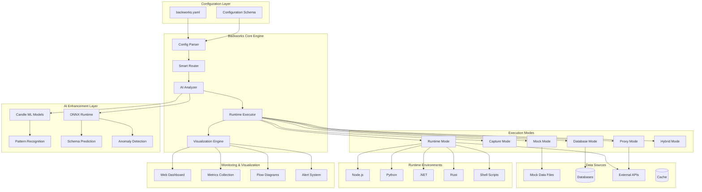
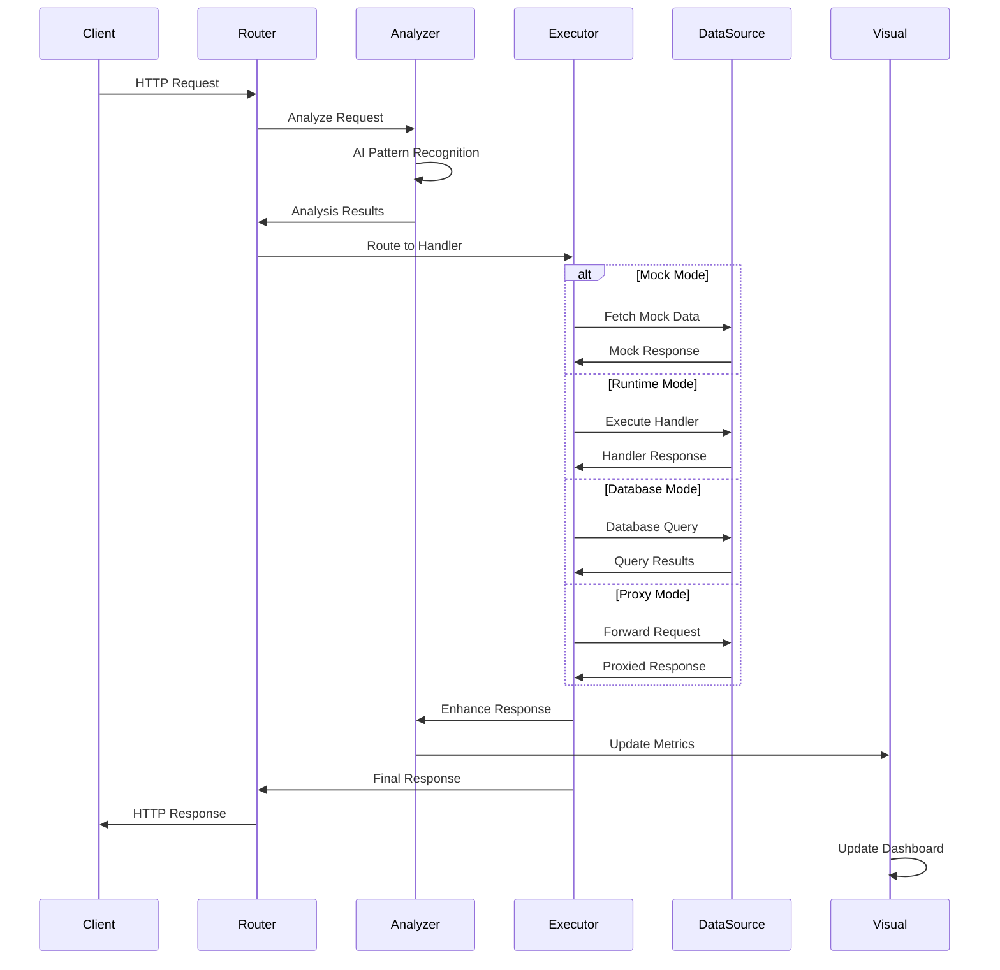

# 🏗️ Backworks Architecture

Backworks is built on a **simple core, complex capabilities** philosophy. The architecture allows for seamless evolution from simple mock APIs to production-ready services while maintaining a unified configuration approach.

## 🎯 Core Principles

### 1. **Configuration-Driven Everything**
- Single YAML file controls all behavior
- No code changes required for mode transitions
- Declarative approach to API development

### 2. **Mode Evolution**
- Start simple, grow complex
- Seamless transitions between modes
- No breaking changes during evolution

### 3. **AI-First Design**
- Intelligence baked into every component
- Learning and improvement over time
- Predictive capabilities for optimization

### 4. **Visual by Default**
- Real-time architecture visualization
- Performance monitoring built-in
- Interactive flow diagrams

## 🏛️ System Architecture



## 🔧 Component Details

### 1. **Configuration Parser**
- Validates YAML configuration
- Resolves environment variables
- Handles configuration inheritance
- Provides schema validation

### 2. **Smart Router**
- Dynamic route generation from config
- Mode-aware request routing
- Parameter validation and extraction
- Middleware chain management

### 3. **AI Analyzer**
- Real-time pattern recognition
- Predictive analytics
- Anomaly detection
- Performance optimization suggestions

### 4. **Runtime Executor**
- Multi-language handler execution
- Process isolation and management
- Resource monitoring and limits
- Error handling and recovery

### 5. **Visualization Engine**
- Real-time flow diagram generation
- Performance metrics visualization
- Interactive architecture maps
- Alert and notification system

## 🔄 Request Flow Architecture



## 📊 Data Flow Architecture

### Configuration Flow
```
YAML Config → Parser → Validation → Router Setup → Handler Registration
```

### Request Processing Flow
```
HTTP Request → Router → AI Analysis → Handler Execution → Response Enhancement → Client Response
```

### Monitoring Flow
```
Request/Response → Metrics Collection → AI Analysis → Visualization Update → Dashboard Refresh
```

## 🤖 AI Integration Architecture

### Model Integration
```rust
pub struct AIEnhancer {
    // Candle models for custom ML tasks
    candle_models: HashMap<String, CandleModel>,
    
    // ONNX models for standardized tasks
    onnx_models: HashMap<String, OnnxModel>,
    
    // Pattern recognition engine
    pattern_engine: PatternRecognizer,
    
    // Prediction and forecasting
    predictor: RequestPredictor,
}
```

### AI Processing Pipeline
1. **Request Analysis** - Pattern recognition and classification
2. **Schema Prediction** - Dynamic schema generation from data
3. **Performance Prediction** - Response time and resource forecasting
4. **Anomaly Detection** - Security and error pattern identification
5. **Optimization Suggestions** - Architecture improvement recommendations

## 🎨 Visualization Architecture

### Real-Time Dashboard Components
- **Flow Diagrams** - Live request flow visualization
- **Architecture Maps** - System topology and connections
- **Performance Metrics** - Response times, throughput, errors
- **AI Insights** - Pattern analysis and predictions

### Dashboard Technology Stack
- **Frontend**: Modern web technologies (WebGL for complex visualizations)
- **Backend**: WebSocket connections for real-time updates
- **Data**: Time-series metrics storage
- **Rendering**: Canvas-based interactive diagrams

## 🔒 Security Architecture

### Security Layers
1. **Input Validation** - Schema-based request validation
2. **Authentication** - Pluggable auth providers
3. **Authorization** - Role-based access control
4. **Rate Limiting** - AI-enhanced rate limiting
5. **Anomaly Detection** - ML-powered threat detection

### Security Features
- Automatic security header injection
- SQL injection detection
- XSS prevention
- CSRF protection
- Request signature validation

## 📈 Scalability Architecture

### Horizontal Scaling
- **Load Balancing** - Intelligent request distribution
- **Service Discovery** - Dynamic service registration
- **Health Checks** - Automated health monitoring
- **Circuit Breakers** - Fault tolerance patterns

### Performance Optimization
- **Intelligent Caching** - AI-driven cache strategies
- **Connection Pooling** - Database connection management
- **Resource Monitoring** - Real-time resource tracking
- **Auto-scaling** - Dynamic resource allocation

## 🔧 Extension Architecture

### Plugin System
- **Handler Plugins** - Custom request handlers
- **Middleware Plugins** - Request/response middleware
- **AI Model Plugins** - Custom ML models
- **Visualization Plugins** - Custom dashboard components

### API Extensions
- **REST API** - Configuration and monitoring API
- **WebSocket API** - Real-time updates
- **Webhook API** - Event notifications
- **GraphQL API** - Flexible data querying

This architecture ensures Backworks remains simple to use while providing enterprise-grade capabilities for complex scenarios.
