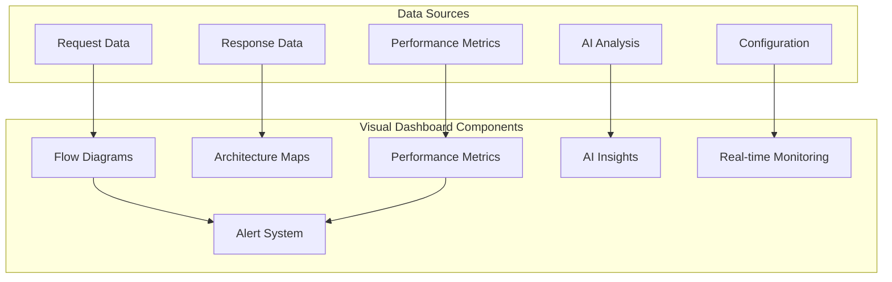

# 📊 Visual Dashboard

Backworks provides a comprehensive visual dashboard that offers real-time insights into your API architecture, performance, and behavior. The dashboard transforms complex API ecosystems into intuitive, interactive visualizations.

## 🎯 Dashboard Overview



## 🎨 Dashboard Configuration

### Basic Setup
```yaml
dashboard:
  enabled: true
  port: 3000
  auto_open: true                 # Auto-open browser on start
  
  # Access configuration
  access:
    public: false                 # Require authentication
    api_key_env: "DASHBOARD_API_KEY"
    allowed_ips: ["127.0.0.1", "10.0.0.0/8"]
```

### Advanced Configuration
```yaml
dashboard:
  enabled: true
  port: 3000
  
  # Feature toggles
  features:
    - "flows"                     # Flow diagrams
    - "architecture"              # Architecture overview
    - "metrics"                   # Performance metrics
    - "ai_insights"               # AI-powered insights
    - "logs"                      # Request/response logs
    - "alerts"                    # Alert management
    - "configuration"             # Live config editing
    
  # Real-time updates
  real_time:
    enabled: true
    update_frequency: 1000        # Update every 1 second
    max_history: 1000             # Keep last 1000 events
    
  # Visualization settings
  visualization:
    theme: "dark"                 # dark, light, auto
    layout: "hierarchical"        # hierarchical, force-directed, circular
    animations: true
    color_scheme: "modern"        # modern, classic, colorblind-friendly
    
  # Export options
  export:
    enabled: true
    formats: ["png", "svg", "pdf", "json"]
    auto_export: false
```

## 🌊 Flow Diagrams

### Real-Time Request Flow Visualization
The dashboard shows live request flows through your API architecture:

```yaml
# Flow visualization configuration
dashboard:
  flows:
    enabled: true
    
    # What to visualize
    show_components:
      - "client_requests"          # Client request origins
      - "api_endpoints"            # API endpoints
      - "handlers"                 # Request handlers
      - "external_apis"            # External API calls
      - "databases"                # Database interactions
      - "cache_layers"             # Caching systems
      
    # Flow animation settings
    animation:
      enabled: true
      speed: "normal"              # slow, normal, fast
      show_data_packets: true      # Animate data flow
      highlight_errors: true       # Highlight error paths
      
    # Interactive features
    interaction:
      click_for_details: true      # Click components for details
      filter_by_endpoint: true     # Filter flows by endpoint
      time_range_selection: true   # Select time ranges
```

### Flow Diagram Features

**Request Tracing:**
```
[Client] → [Load Balancer] → [Backworks Router] → [Auth Middleware]
                                     ↓
[Endpoint Handler] → [External API] → [Database] → [Cache]
                                     ↓
[Response Transform] → [Client Response]
```

**Performance Visualization:**
- Color-coded response times (green = fast, red = slow)
- Flow thickness indicates request volume
- Animated data packets show real-time traffic
- Error paths highlighted in red

**Interactive Elements:**
- Click any component to see detailed metrics
- Hover for quick statistics
- Filter flows by time, endpoint, or status
- Drill down into specific request traces

## 🏗️ Architecture Overview

### System Topology Visualization
```yaml
dashboard:
  architecture:
    enabled: true
    
    # Architecture views
    views:
      - "system_overview"          # High-level system view
      - "service_dependencies"     # Service dependency graph
      - "data_flow"               # Data flow diagrams
      - "deployment_topology"     # Deployment architecture
      
    # Component display
    components:
      - "api_endpoints"
      - "databases"
      - "external_services"
      - "cache_layers"
      - "load_balancers"
      - "monitoring_systems"
      
    # Health indicators
    health_status:
      show_status: true           # Show health status
      status_indicators: ["healthy", "warning", "error", "unknown"]
      auto_refresh: true
```

### Architecture Diagram Types

**Service Dependency Graph:**
```
┌─────────────────┐
│   Backworks     │
│   Core Engine   │
└─────────────────┘
         │
    ┌────┼────┐
    ▼    ▼    ▼
┌─────┐ ┌───┐ ┌──────┐
│ DB  │ │API│ │Cache │
└─────┘ └───┘ └──────┘
```

**Data Flow Visualization:**
- Request → Processing → Storage → Response
- Show data transformations at each step
- Highlight bottlenecks and optimization opportunities
- Display data volume and processing times

## 📊 Performance Metrics

### Real-Time Performance Dashboard
```yaml
dashboard:
  metrics:
    enabled: true
    
    # Metric types
    metric_categories:
      - "response_times"           # API response times
      - "throughput"              # Requests per second
      - "error_rates"             # Error percentages
      - "resource_usage"          # CPU, memory, disk
      - "external_api_performance" # External API metrics
      
    # Time windows
    time_windows:
      - "1m"                      # Last minute
      - "5m"                      # Last 5 minutes
      - "1h"                      # Last hour
      - "24h"                     # Last 24 hours
      - "7d"                      # Last week
      
    # Visualization types
    chart_types:
      - "line_charts"             # Time series
      - "bar_charts"              # Comparisons
      - "heatmaps"               # Pattern visualization
      - "gauge_charts"           # Current values
```

### Performance Metric Examples

**Response Time Dashboard:**
```
┌─ Response Times (Last Hour) ────────────────┐
│                                             │
│  200ms ┤                            ╭─╮    │
│        │                         ╭──╯ ╰─╮  │
│  100ms ┤           ╭─╮         ╭─╯      ╰╮ │
│        │        ╭──╯ ╰─╮    ╭──╯         ╰│
│   50ms ┤     ╭──╯      ╰─╮╭─╯             │
│        │  ╭──╯           ╰╯               │
│    0ms └──╯─────────────────────────────────│
│        12:00  12:15  12:30  12:45  13:00  │
└─────────────────────────────────────────────┘
```

**Throughput Monitoring:**
```
┌─ Requests per Second ───────────────────────┐
│                                             │
│  Current: 245 req/s     Peak: 389 req/s    │
│  Average: 198 req/s     Min:   45 req/s    │
│                                             │
│  ████████████████████████░░░░░░░░░░ 67%     │
│                                             │
└─────────────────────────────────────────────┘
```

## 🤖 AI Insights Panel

### Intelligent Analysis Dashboard
```yaml
dashboard:
  ai_insights:
    enabled: true
    
    # AI insight categories
    insights:
      - "pattern_analysis"         # Usage pattern insights
      - "performance_predictions"  # Future performance forecasts
      - "optimization_suggestions" # Improvement recommendations
      - "anomaly_alerts"          # Unusual behavior detection
      - "capacity_planning"       # Resource planning insights
      
    # Insight display
    display:
      confidence_scores: true     # Show AI confidence
      reasoning: true             # Show AI reasoning
      action_suggestions: true    # Suggest specific actions
      trend_analysis: true        # Show trends and patterns
```

### AI Insight Examples

**Pattern Recognition:**
```
🧠 AI Insights - Pattern Analysis

📊 Detected Patterns (Last 24h):
┌─────────────────────────────────────────────┐
│ User Authentication Flow                    │
│ Confidence: 94%                             │
│ Frequency: 1,247 occurrences               │
│ 💡 Suggestion: Implement JWT caching       │
│    Potential savings: 15% response time    │
└─────────────────────────────────────────────┘

┌─────────────────────────────────────────────┐
│ Batch Data Export Pattern                   │
│ Confidence: 87%                             │
│ Trigger: Large CSV downloads               │
│ ⚠️ Warning: Memory usage spike detected     │
│ 💡 Suggestion: Implement streaming export   │
└─────────────────────────────────────────────┘
```

**Performance Predictions:**
```
🔮 Performance Predictions

📈 Next 4 Hours:
• 14:00-15:00: High load expected (↑67%)
• 15:00-16:00: Peak traffic (↑89%)
• 16:00-17:00: Gradual decline (↓23%)
• 17:00-18:00: Normal levels (baseline)

🎯 Recommendations:
• Scale horizontally at 13:45
• Enable aggressive caching at 14:30
• Monitor database connections closely
```

## 🚨 Alert Management

### Real-Time Alert System
```yaml
dashboard:
  alerts:
    enabled: true
    
    # Alert sources
    sources:
      - "performance_thresholds"   # Performance-based alerts
      - "error_rate_spikes"       # Error rate increases
      - "ai_anomaly_detection"    # AI-detected anomalies
      - "resource_exhaustion"     # Resource limit alerts
      - "external_api_failures"   # External service issues
      
    # Alert severity levels
    severity_levels:
      - "info"                    # Informational
      - "warning"                 # Warning level
      - "error"                   # Error level
      - "critical"                # Critical issues
      
    # Alert actions
    actions:
      - "dashboard_notification"  # Show in dashboard
      - "email_notification"      # Send email
      - "slack_notification"      # Post to Slack
      - "webhook_trigger"         # Trigger webhook
      - "auto_scaling"            # Trigger auto-scaling
```

### Alert Dashboard
```
🚨 Active Alerts

🔴 CRITICAL - Database Connection Pool Exhausted
   Time: 13:45:32    Endpoint: /users
   Action: Auto-scaling triggered

🟡 WARNING - Response Time Spike  
   Time: 13:44:15    Endpoint: /reports
   Suggestion: Enable caching

🔵 INFO - New Usage Pattern Detected
   Time: 13:40:22    Pattern: Bulk user import
   Action: Update capacity planning
```

## 📱 Interactive Features

### Live Configuration Editor
```yaml
dashboard:
  live_editing:
    enabled: true
    
    # Editable configurations
    editable:
      - "endpoint_configurations"  # Modify endpoints
      - "ai_settings"             # Adjust AI parameters
      - "performance_thresholds"  # Update alert thresholds
      - "cache_configurations"    # Modify caching rules
      
    # Safety features
    safety:
      validation: true            # Validate changes
      backup_creation: true       # Create backups
      rollback_capability: true   # Enable rollbacks
      change_approval: false      # Require approval (optional)
```

### Request Explorer
```yaml
dashboard:
  request_explorer:
    enabled: true
    
    # Request investigation
    features:
      - "request_timeline"        # Timeline view of requests
      - "payload_inspector"       # Inspect request/response data
      - "performance_breakdown"   # Detailed performance metrics
      - "trace_analysis"          # End-to-end request tracing
      
    # Data retention
    retention:
      detailed_logs: "24h"        # Keep detailed logs for 24h
      summary_data: "30d"         # Keep summaries for 30 days
      performance_metrics: "90d"  # Keep metrics for 90 days
```

## 🎨 Customization Options

### Theme and Layout
```yaml
dashboard:
  customization:
    themes:
      available: ["dark", "light", "high-contrast", "blue", "green"]
      default: "dark"
      
    layouts:
      available: ["default", "compact", "detailed", "minimal"]
      default: "default"
      
    widgets:
      customizable: true
      drag_and_drop: true
      resizable: true
      
    branding:
      logo_url: "./assets/company-logo.png"
      company_name: "Your Company"
      custom_css: "./styles/custom.css"
```

### Dashboard API
```yaml
dashboard:
  api:
    enabled: true
    endpoints:
      - "/api/dashboard/metrics"   # Get metrics data
      - "/api/dashboard/config"    # Get/update configuration
      - "/api/dashboard/alerts"    # Manage alerts
      - "/api/dashboard/export"    # Export data
      
    authentication:
      required: true
      method: "api_key"
      
    rate_limiting:
      requests_per_minute: 100
```

## 🚀 Getting Started

### Basic Dashboard Setup
```yaml
# Minimal dashboard configuration
dashboard:
  enabled: true
  features: ["flows", "metrics"]
```

### Full-Featured Dashboard
```yaml
# Complete dashboard setup
dashboard:
  enabled: true
  port: 3000
  
  features:
    - "flows"
    - "architecture"
    - "metrics" 
    - "ai_insights"
    - "alerts"
    - "logs"
    
  real_time:
    enabled: true
    update_frequency: 1000
    
  ai_insights:
    enabled: true
    confidence_threshold: 0.8
    
  alerts:
    enabled: true
    notifications: ["email", "slack"]
```

The Backworks dashboard transforms your API into a visual, interactive experience that makes complex systems easy to understand, monitor, and optimize.
