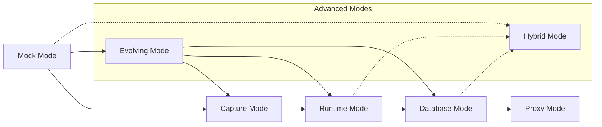

# 🔄 Evolution Modes

Backworks supports multiple execution modes that allow seamless evolution from simple prototypes to production-ready APIs. Each mode serves a specific purpose in the API development lifecycle.

## 🎯 Mode Overview



## 🎭 Mock Mode

Perfect for **rapid prototyping** and **frontend development**. Provides instant API responses from static or dynamic mock data.

### Configuration
```yaml
name: "prototype_api"
mode: "mock"

endpoints:
  users:
    path: "/users"
    mock:
      # Static data
      data:
        - id: 1
          name: "John Doe"
          email: "john@example.com"
        - id: 2
          name: "Jane Smith"
          email: "jane@example.com"
    
  user_detail:
    path: "/users/{id}"
    mock:
      # Dynamic data with parameters
      data:
        id: "${path.id}"
        name: "User ${path.id}"
        email: "user${path.id}@example.com"
        created_at: "${now()}"
        
  create_user:
    path: "/users"
    methods: ["POST"]
    mock:
      # Response based on request
      data:
        id: "${random_int(1000, 9999)}"
        name: "${request.body.name}"
        email: "${request.body.email}"
        created_at: "${now()}"
        status: "created"
```

### Features
- **Instant Setup** - API running in seconds
- **Dynamic Responses** - Use request data and functions
- **Multiple Response Formats** - JSON, XML, plain text
- **Realistic Data** - Built-in data generators
- **Stateful Mocking** - Maintain state between requests

### Built-in Functions
```yaml
mock:
  data:
    id: "${random_int(1, 1000)}"           # Random integer
    uuid: "${random_uuid()}"               # Random UUID
    timestamp: "${now()}"                  # Current timestamp
    email: "${random_email()}"             # Random email
    name: "${random_name()}"               # Random name
    phone: "${random_phone()}"             # Random phone
    future_date: "${date_add(now(), 30)}"  # Date arithmetic
    request_data: "${request.body.field}"  # Request data
    path_param: "${path.id}"               # Path parameter
    query_param: "${query.filter}"         # Query parameter
```

## 🔍 Capture Mode

**Learn from existing APIs** by capturing and analyzing real request patterns. Perfect for reverse engineering and API migration.

### Configuration
```yaml
name: "learning_api"
mode: "capture"

# Listener configuration
listeners:
  http:
    port: 8080
    capture_all: true
    
  proxy:
    port: 8081
    target: "https://existing-api.com"
    capture_and_forward: true

# What to capture and analyze
capture:
  requests:
    headers: true
    body: true
    query_parameters: true
    
  responses:
    headers: true
    body: true
    status_code: true
    response_time: true
    
  analysis:
    auto_generate_schema: true
    detect_patterns: true
    group_similar_requests: true
    export_openapi: true
```

### AI-Enhanced Analysis
```yaml
capture:
  ai_analysis:
    enabled: true
    features:
      - "endpoint_discovery"      # Detect API endpoints
      - "parameter_extraction"    # Extract parameter patterns
      - "schema_generation"       # Generate JSON schemas
      - "authentication_analysis" # Detect auth patterns
      - "rate_limit_detection"    # Identify rate limits
      
  suggestions:
    missing_endpoints: true       # Suggest missing CRUD operations
    optimization_opportunities: true
    security_improvements: true
```

### Export Formats
```yaml
capture:
  export:
    openapi: "./generated/openapi.yaml"
    postman: "./generated/collection.json"
    backworks: "./generated/project.yaml"
    curl_commands: "./generated/curl.sh"
```

## ⚡ Runtime Mode

Execute **custom business logic** using multiple programming languages. Perfect for complex processing and integrations.

### JavaScript Handler
```yaml
name: "business_logic_api"
mode: "runtime"

endpoints:
  process_order:
    path: "/orders"
    methods: ["POST"]
    runtime:
      language: "javascript"
      handler: |
        export default async (request, context) => {
          const { items, customer_id } = request.body;
          
          // Calculate total
          let total = 0;
          for (const item of items) {
            const product = await context.database.query(
              'SELECT price FROM products WHERE id = ?', [item.id]
            );
            total += product.price * item.quantity;
          }
          
          // Process payment
          const payment = await context.apis.stripe.post('/charges', {
            amount: total * 100,
            currency: 'usd',
            customer: customer_id
          });
          
          // Send confirmation
          await context.apis.sendgrid.post('/mail/send', {
            to: [{ email: customer.email }],
            subject: 'Order Confirmation',
            content: [{ 
              type: 'text/html', 
              value: `Order total: $${total}` 
            }]
          });
          
          return {
            order_id: payment.id,
            total,
            status: 'confirmed'
          };
        }
```

### Python Handler
```yaml
endpoints:
  ml_prediction:
    path: "/predict"
    runtime:
      language: "python"
      handler: "./handlers/ml_prediction.py"
      requirements: "./requirements.txt"
```

```python
# handlers/ml_prediction.py
import json
import numpy as np
from sklearn.externals import joblib

def handler(request, context):
    model = joblib.load('./models/prediction_model.pkl')
    
    features = request['body']['features']
    prediction = model.predict([features])
    confidence = model.predict_proba([features]).max()
    
    return {
        'status': 200,
        'data': {
            'prediction': prediction[0],
            'confidence': float(confidence),
            'model_version': '1.2.0'
        }
    }
```

### Multi-Language Support
```yaml
runtimes:
  javascript: { command: "node", working_dir: "./js" }
  python: { command: "python3", working_dir: "./python" }
  dotnet: { command: "dotnet run", working_dir: "./dotnet" }
  rust: { command: "cargo run", working_dir: "./rust" }
  shell: { command: "bash", working_dir: "./shell" }
  go: { command: "go run", working_dir: "./go" }
```

## 🗄️ Database Mode

Connect directly to databases with **automatic CRUD operations** and custom queries.

### Auto-CRUD Configuration
```yaml
name: "database_api"
mode: "database"

database:
  type: "postgresql"
  connection_string_env: "DATABASE_URL"

endpoints:
  users:
    path: "/users"
    methods: ["GET", "POST", "PUT", "DELETE"]
    database:
      table: "users"
      auto_crud: true              # Auto-generate CRUD operations
      
      # Custom field mapping
      fields:
        id: { type: "integer", primary_key: true }
        name: { type: "string", required: true }
        email: { type: "string", unique: true }
        created_at: { type: "timestamp", auto_generate: true }
```

### Custom Queries
```yaml
endpoints:
  analytics:
    path: "/analytics"
    database:
      query: |
        SELECT 
          DATE(created_at) as date,
          COUNT(*) as user_count,
          AVG(order_value) as avg_order
        FROM users u
        LEFT JOIN orders o ON u.id = o.user_id
        WHERE u.created_at >= NOW() - INTERVAL '30 days'
        GROUP BY DATE(created_at)
        ORDER BY date
        
  search_users:
    path: "/users/search"
    database:
      query: |
        SELECT * FROM users 
        WHERE name ILIKE '%${query.q}%' 
        OR email ILIKE '%${query.q}%'
        ORDER BY created_at DESC
        LIMIT ${query.limit:-10}
```

### Multiple Databases
```yaml
databases:
  primary:
    type: "postgresql"
    connection_string_env: "PRIMARY_DB_URL"
  analytics:
    type: "clickhouse"
    connection_string_env: "ANALYTICS_DB_URL"
  cache:
    type: "redis"
    connection_string_env: "REDIS_URL"

endpoints:
  users:
    database: "primary"
    table: "users"
    
  metrics:
    database: "analytics"
    query: "SELECT * FROM metrics WHERE date >= yesterday()"
```

## 🔄 Proxy Mode

Forward requests to existing services while adding **monitoring, caching, and transformations**.

### Simple Proxy
```yaml
name: "gateway_api"
mode: "proxy"

endpoints:
  user_service:
    path: "/users/*"
    proxy:
      target: "http://user-service:8081"
      strip_prefix: "/users"
      
  order_service:
    path: "/orders/*"
    proxy:
      target: "http://order-service:8082"
      timeout: 30
```

### Enhanced Proxy with Transformations
```yaml
endpoints:
  legacy_api:
    path: "/legacy/*"
    proxy:
      target: "https://legacy-system.com/api"
      
      # Request transformation
      transform_request:
        add_headers:
          "X-API-Key": "${LEGACY_API_KEY}"
          "User-Agent": "Backworks/1.0"
        remove_headers: ["Authorization"]
        
        # Transform request body
        transform_body: |
          // Convert new format to legacy format
          return {
            legacy_format: request.modern_format,
            timestamp: new Date().toISOString()
          };
          
      # Response transformation
      transform_response:
        add_headers:
          "X-Proxied-By": "Backworks"
        
        # Transform response body  
        transform_body: |
          // Convert legacy format to new format
          return {
            modern_format: response.legacy_format,
            processed_at: response.timestamp
          };
```

## 🎭 Hybrid Mode

Combine multiple modes for **maximum flexibility**. Different endpoints can use different modes.

```yaml
name: "hybrid_api"
mode: "hybrid"

endpoints:
  # Mock endpoint for development
  users:
    path: "/users"
    mode: "mock"
    mock:
      data: [{"id": 1, "name": "Mock User"}]
      
  # Database endpoint for real data
  products:
    path: "/products"
    mode: "database"
    database:
      table: "products"
      auto_crud: true
      
  # Runtime endpoint for business logic
  orders:
    path: "/orders"
    mode: "runtime"
    runtime:
      language: "javascript"
      handler: "./handlers/orders.js"
      
  # Proxy endpoint for external service
  payments:
    path: "/payments/*"
    mode: "proxy"
    proxy:
      target: "https://payment-service.com"
```

## 🔄 Evolving Mode

**Automatically evolve** between modes based on configuration and AI analysis.

```yaml
name: "evolving_api"
mode: "evolving"

# Evolution strategy
evolution:
  # Start with mock, evolve based on conditions
  initial_mode: "mock"
  
  # Conditions for evolution
  evolution_triggers:
    to_capture:
      condition: "request_count > 100"
      analyze_duration: "1h"
      
    to_runtime:
      condition: "capture_confidence > 0.8"
      auto_generate_handlers: true
      
    to_database:
      condition: "database_available && data_patterns_stable"
      
  # AI-driven evolution
  ai_evolution:
    enabled: true
    confidence_threshold: 0.85
    suggest_optimizations: true

endpoints:
  users:
    path: "/users"
    
    # Start with mock
    mock:
      data: [{"id": 1, "name": "John"}]
      
    # Evolution targets
    evolution_path:
      - mode: "capture"
        trigger: "request_count > 50"
      - mode: "runtime"  
        trigger: "patterns_identified"
        handler_template: "crud"
      - mode: "database"
        trigger: "database_schema_ready"
```

## 🔧 Mode-Specific Features

### Performance Optimization
```yaml
# Per-mode optimizations
optimization:
  mock:
    cache_responses: true
    precompile_templates: true
    
  runtime:
    pool_handlers: true
    cache_compiled_code: true
    
  database:
    connection_pooling: true
    query_caching: true
    
  proxy:
    response_caching: true
    connection_reuse: true
```

### Error Handling
```yaml
# Mode-specific error handling
error_handling:
  mock:
    fallback_to_default: true
    
  runtime:
    retry_attempts: 3
    fallback_to_mock: true
    
  database:
    retry_on_connection_error: true
    fallback_query: "SELECT 'service unavailable' as message"
    
  proxy:
    fallback_endpoints: ["http://backup.service.com"]
    circuit_breaker: true
```

## 🚀 Best Practices

### Development Workflow
1. **Start with Mock** - Rapid prototyping and frontend development
2. **Add Capture** - Learn from real usage patterns  
3. **Implement Runtime** - Add custom business logic
4. **Connect Database** - Persistent data storage
5. **Use Proxy** - Integrate with existing services

### Production Considerations
- **Hybrid Mode** for mixed requirements
- **Database Mode** for high performance
- **Proxy Mode** for microservices integration
- **Runtime Mode** for complex business logic

### Monitoring Across Modes
- All modes support visual dashboard
- Performance metrics collection
- AI-powered insights and optimization
- Real-time flow visualization

Each mode in Backworks is designed to serve specific needs while maintaining the ability to seamlessly evolve as your requirements change.
